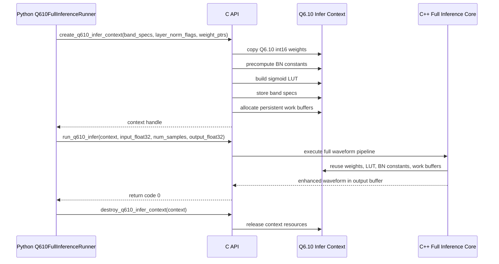
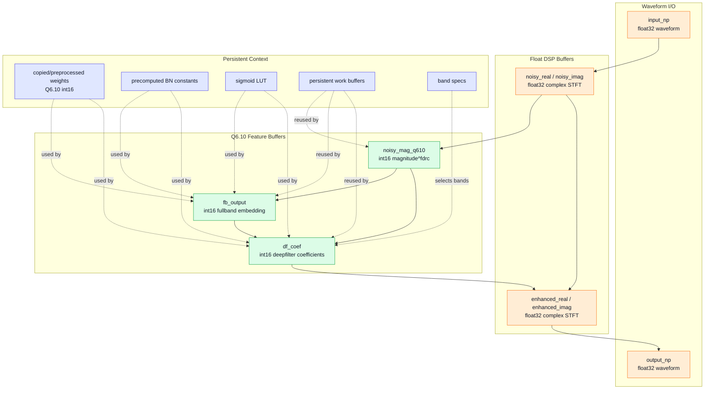

# Q6.10 Full Inference Diagram Guide

This guide is for generating an accurate technical diagram of the current optimized
Q6.10 inference path. The target is the full C++ Q6.10 runtime connected through
`Q610FullInferenceRunner`, not the older subband-only or hybrid path.

## Diagram Target

Draw this path only:

```text
mono float32 waveform
  -> Python Q610FullInferenceRunner
  -> C API run_q610_infer
  -> C++ fixed STFT
  -> magnitude + FDRC
  -> Q6.10 fullband GSU
  -> Q6.10 subband GSU, 3 bands
  -> C++ deepfiltering
  -> fixed iSTFT / overlap-add
  -> mono float32 enhanced waveform
```

Core implementation sources:

| Role | File |
|:---|:---|
| Full C++ Q6.10 inference engine | `energy_measure/native/q610_full_infer_c_api.cpp` |
| Python binding and CLI integration | `energy_measure/measure_energy.py` |
| Q6.10 subband reference logic | `subband_ref_q610.cpp` |

Public C API names to show in diagrams:

| API | Purpose |
|:---|:---|
| `create_q610_infer_context` | Create the persistent inference context and copy/preprocess model weights. |
| `run_q610_infer` | Run one full waveform-to-waveform inference call. |
| `destroy_q610_infer_context` | Release the persistent context and buffers. |

Python binding name to show:

```text
Q610FullInferenceRunner
```

Do not label this path as ANN, PyTorch full inference, or subband-only acceleration.

## Data Types

| Data | Type |
|:---|:---|
| Input waveform | contiguous mono `float32` |
| STFT real/imag buffers | `float32` |
| Magnitude features after FDRC | Q6.10 `int16` |
| Fullband/subband weights | Q6.10 `int16` |
| Fullband/subband activations | Q6.10 `int16` |
| Dot-product accumulation | `int32` |
| Deepfiltering coefficients | Q6.10 `int16`, converted internally for complex multiply |
| Output waveform | contiguous mono `float32` |

Fixed acoustic parameters:

| Parameter | Value |
|:---|---:|
| `n_fft` | `512` |
| `hop` | `128` |
| `win` | `512` |
| Window | Hann |
| FFT | fixed 512-point iterative radix-2 FFT |

Model assumptions for this diagram:

| Component | Fixed Shape / Behavior |
|:---|:---|
| Fullband GSU input | `64` |
| Fullband GSU hidden | `320` |
| Fullband GSU layers | `2` |
| Fullband projection | `64` |
| Subband stages | `3` bands |
| Subband hidden | `224` |
| Subband layers | `2` per band |
| Subband center sizes | `[8, 32, 64]` |
| Deepfilter orders | `[5, 3, 1]` |
| Speakers | `num_spks=1` |
| BN | enabled, constants precomputed |
| Weights | shared Q6.10 `int16` weights |

## Mermaid 1: Full Inference Pipeline

Use this as the main paper/report block diagram.

```mermaid
flowchart LR
    A["Mono input waveform<br/>float32 contiguous"]:::float
    B["Python binding<br/>Q610FullInferenceRunner"]:::python
    C["C API<br/>run_q610_infer"]:::api
    D["Fixed STFT<br/>512-point FFT<br/>n_fft=512 hop=128 Hann"]:::float
    E["Magnitude + FDRC<br/>float magnitude -> Q6.10 int16"]:::convert
    F["Fullband GSU Q6.10<br/>input=64 hidden=320 layers=2 proj=64<br/>int16 weights, int32 accumulation"]:::q610
    G["Subband GSU Q6.10 x3 bands<br/>center=[8,32,64], df_order=[5,3,1]<br/>hidden=224 layers=2"]:::q610
    H["Deepfiltering in C++<br/>Q6.10 coef applied to float32 complex STFT"]:::float
    I["Fixed iSTFT / OLA<br/>Hann overlap-add"]:::float
    J["Enhanced waveform<br/>float32 contiguous"]:::float

    A --> B --> C --> D --> E --> F --> G --> H --> I --> J

    classDef python fill:#e5e7eb,stroke:#4b5563,color:#111827;
    classDef api fill:#dbeafe,stroke:#2563eb,color:#111827;
    classDef q610 fill:#dcfce7,stroke:#16a34a,color:#111827;
    classDef float fill:#ffedd5,stroke:#f97316,color:#111827;
    classDef convert fill:#fef9c3,stroke:#ca8a04,color:#111827;
```



## Mermaid 2: Python / C API / Context Sequence

Use this to explain why repeated inference avoids repeatedly passing and rebuilding
large weight structures.



## Mermaid 3: Internal C++ Buffer / Dataflow

Use this to show which buffers remain float and which buffers are Q6.10.



## GPT Image Prompt

Copy this prompt into an image-generation model when a polished paper-style diagram
is needed.

```text
Create a clean technical block diagram for a paper/report showing an optimized
Q6.10 full inference path for a Spiking FullSubNet speech enhancement model.

Draw a left-to-right pipeline. The input is "Mono float32 waveform". It enters
a gray Python block labeled "Q610FullInferenceRunner". Then it enters a blue
C API block labeled "run_q610_infer". Inside the C++ runtime, show these blocks:
"Fixed STFT, n_fft=512, hop=128, Hann, 512-point radix-2 FFT"; "Magnitude + FDRC,
float to Q6.10 int16"; "Fullband GSU Q6.10, input 64, hidden 320, 2 layers,
projection 64"; "Subband GSU Q6.10, 3 bands, center sizes 8/32/64,
DF orders 5/3/1, hidden 224, 2 layers"; "Deepfiltering in C++"; and
"Fixed iSTFT / overlap-add". The output is "Enhanced float32 waveform".

Use these color rules: Python blocks gray, C API blocks blue, C++ Q6.10 neural
core blocks green, float DSP blocks orange, conversion blocks yellow. Add a
side context box labeled "Persistent Q6.10 inference context" containing:
"Q6.10 int16 weights", "int32 accumulation", "sigmoid LUT",
"precomputed BN constants", "persistent work buffers", and "band specs".

Make the figure precise and engineering-oriented, with clear arrows and no
decorative background. Do not include ANN FullSubNet, PyTorch deepfiltering,
PyTorch iSTFT, RAPL, energy measurement, or the older subband-only hybrid path.
```

## Compact Prompt

Use this shorter version when the model has limited prompt length.

```text
Draw a paper-style block diagram of the current Q6.10 full C++ inference path:
float32 mono waveform -> Python Q610FullInferenceRunner -> C API run_q610_infer
-> fixed STFT (512 FFT, hop 128, Hann) -> magnitude+FDRC to Q6.10 int16
-> fullband GSU Q6.10 -> subband GSU Q6.10 x3 bands -> C++ deepfiltering
-> fixed iSTFT/OLA -> float32 enhanced waveform. Show a persistent context box
with Q6.10 int16 weights, int32 accumulation, sigmoid LUT, precomputed BN
constants, band specs, and persistent work buffers. Colors: Python gray,
C API blue, Q6.10 core green, float DSP orange, conversion yellow. Exclude ANN,
PyTorch deepfiltering/iSTFT, RAPL, and old subband-only hybrid paths.
```

## What Not To Draw

Do not include these items in the inference diagram:

- ANN FullSubNet path.
- The older `snn_q610_fast` or `snn_q610_full` hybrid path as if it were the full runtime.
- PyTorch deepfiltering or PyTorch iSTFT after the Q6.10 subband stage.
- Repeated per-call weight pointer passing as the main design.
- RAPL, PKG energy, DRAM energy, or power measurement blocks inside the inference path.
- FPGA/Vitis datapaths; those should be a separate hardware projection diagram.

## Caption Template

```text
Optimized Q6.10 full inference path. The Python runner passes a contiguous
mono float32 waveform to a persistent C++ context through run_q610_infer.
The C++ runtime performs fixed STFT, Q6.10 fullband and subband GSU inference,
deepfiltering, and fixed iSTFT internally. Model weights, sigmoid lookup table,
batch-normalization constants, band specifications, and work buffers are kept
inside the context to reduce Python/PyTorch round trips and repeated setup cost.
```

